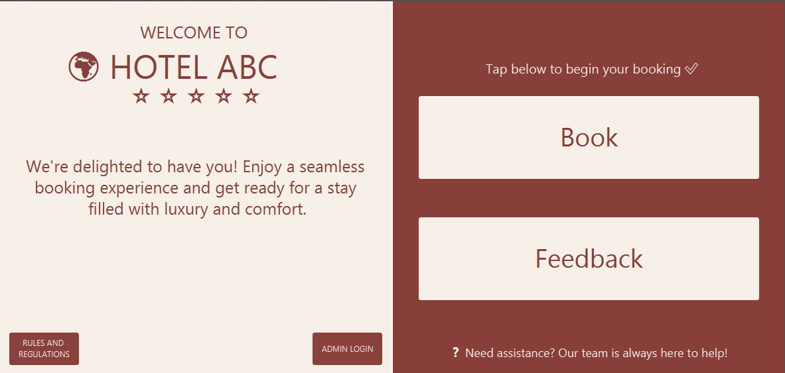
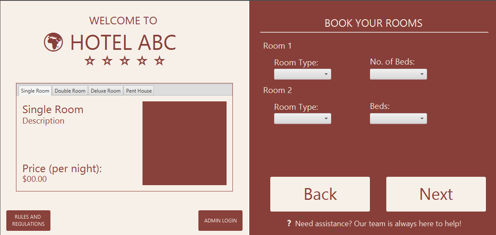
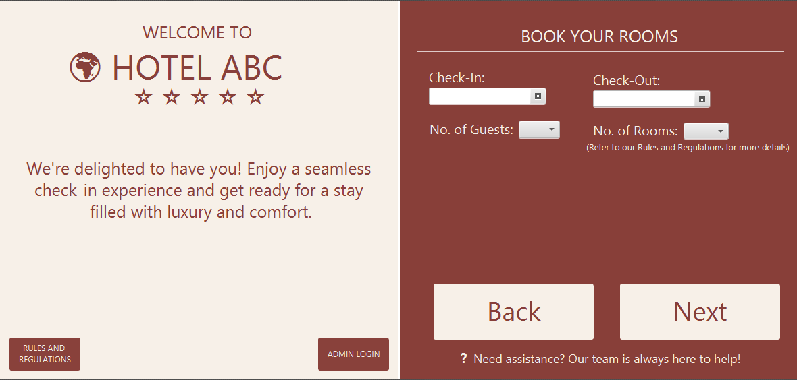
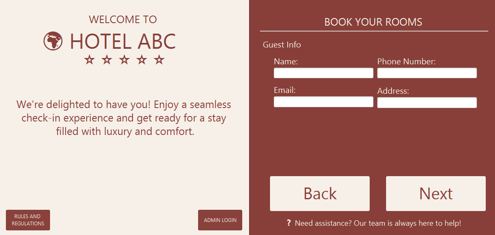
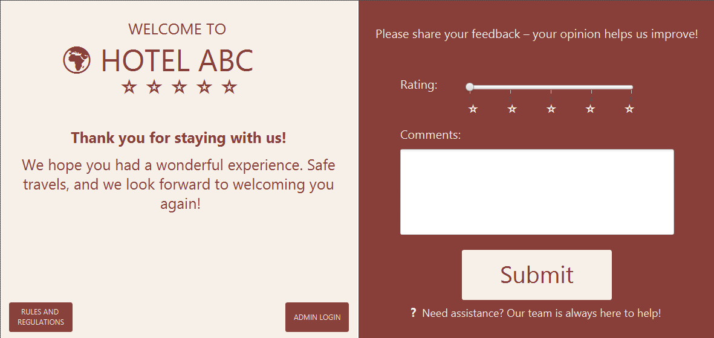
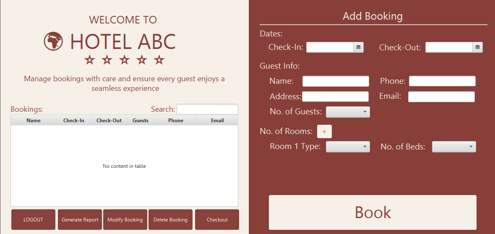

# Hotel Reservation System

A modern, JavaFX-based hotel reservation management system that provides an intuitive interface for both guests and administrators to manage hotel bookings efficiently.

## 🏨 Features

### Guest Features
- **Book Rooms**: Easy-to-use interface for making new reservations
- **Room Selection**: Choose from different room types based on guest count
- 
- **Check In/Out Selection**: Interactive calendar for check-in and check-out date selection
- 
- **Guest Information**: Simple form to provide guest details
- 
- **Guest Feedback**: Once checked out, guests can leave a review and share their experience
- 

### Admin Features
- **Reservation Management**: View and manage all hotel reservations
- 
- **Search Functionality**: Quick search through bookings
- **Status Updates**: Update reservation statuses
- **Guest Management**: Access to guest information and booking history
- **Real-time Updates**: Dynamic table views that reflect changes instantly

## 🛠️ Technical Stack

- **Frontend**: JavaFX
- **Backend**: Java
- **Database**: SQL Database
- **Build Tool**: Maven/Gradle
- **Java Version**: 23

## 🚀 Getting Started

### Prerequisites
- Java JDK 23 or higher
- Maven/Gradle
- SQL Database Server

## 💻 Usage
### Guest Interface
1. Launch the application
2. Select number of guests
3. Choose check-in and check-out dates
4. Select room type
5. Fill in personal information
6. Confirm reservation

### Admin Interface
1. Access the admin panel through the login screen
2. View all reservations in the table view
3. Use the search functionality to find specific bookings
4. Update reservation statuses as needed
5. Manage guest information

## 📝 Database Schema
The system uses the following main tables:
- : Stores booking information `Reservation`
- : Contains guest details `Guest`
- : Maintains room information `Room`
- : Defines different types of rooms `RoomType`
